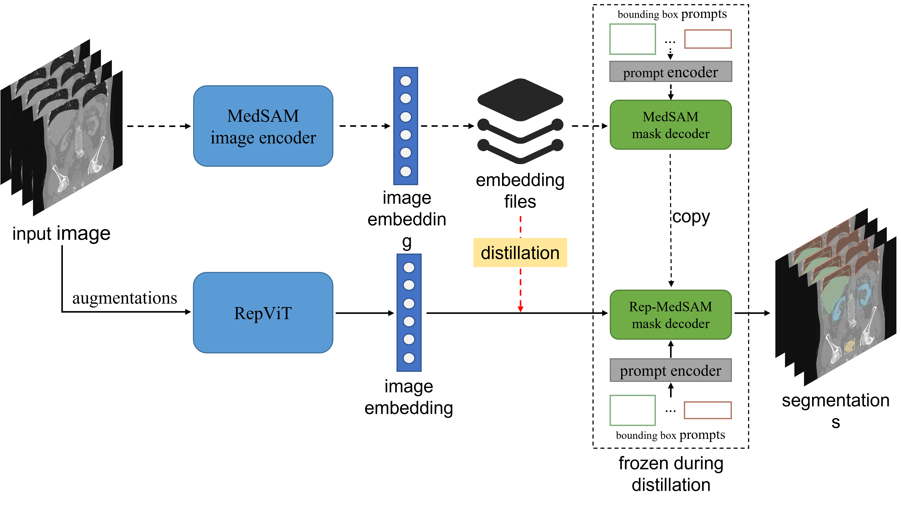

# Solution for CVPR 2024 MedSAM on Laptop Challenge

**Rep-MedSAM: Towards Real-time and Universal Medical Image Segmentation** \
*Muxin Wei, Shuqing Chen, Silin Wu, Dabin Xu*


Built upon [bowang-lab/MedSAM](https://github.com/bowang-lab/MedSAM/tree/LiteMedSAM) and [THU-MIG/RepViT](https://github.com/THU-MIG/RepViT/tree/main/model). This repository provides the solution of our team for [CVPR 2024 MedSAM on Laptop Challenge](https://www.codabench.org/competitions/1847/#/pages-tab). Details of our method are described in our [paper]().

Our distillation framework is shown as follows:
<center>



</center>


$\bf{2.7\times}$ faster for the image encoder

| **Image Encoder** | **TinyViT** | **Rep-ViT** |
|:-----------------:|:-----------:|:-----------:|
| **Parameters(M)** |     5.7     |    **6**    |
|   **Latecy(s)**   |     0.98    |   **0.36**  |
|     **GFLOPs**    |     38.1    |   **32.1**  |


Model weight is available at [ckpts](./ckpts).

We have updated our infer script for 3D volumes, and almost $ \bf{2 \times}$ faster than the original infer script!

| Case ID                 |       Size      | Num. Objects | Baseline | Proposed |  Updated  |
|-------------------------|:---------------:|:------------:|:--------:|:--------:|:---------:|
| 3DBox\_CT\_0566         | (287, 512, 512) |       6      |  436.97  |  194.22  | **73.64** |
| 3DBox\_CT\_0888         | (237, 512, 512) |       6      |  115.53  |   53.44  | **25.09** |
| 3DBox\_CT\_0860         | (246, 512, 512) |       1      |   16.60  |   7.96   |  **6.24** |
| 3DBox\_MR\_0621         | (115, 400, 400) |       6      |  174.80  |   80.45  | **25.81** |
| 3DBox\_MR\_0121         |  (64, 290, 320) |       6      |  119.09  |   54.62  | **16.16** |
| 3DBox\_MR\_0179         |  (84, 512, 512) |       1      |   14.89  |   7.22   |  **5.44** |

## Requirements and Installation

The codebase is tested with: `Ubuntu 20.04` | Python `3.9` | `CUDA 12.2` | `Pytorch 2.0`

1. git clone https://github.com/mxWe1/Rep-MedSAM.git
2. Enter Rep-MedSAM folder `cd Rep-MedSAM` and run `pip install -e .`


**Efficiency for 3D cases have improved almost 2X after updated the infer script.**

## Training

To train Rep-MedSAM, run:
```bash
python train_one_gpu.py \
-data_root /path/to/train_npy \
-pretrained_checkpoint ckpts/rep_medsam.pth \
-work_dir work_dir \
-num_epochs 10 \
-batch_size 16 \
-num_workers 12 
```
### Pretraining Distillation

To perform pretraining distillation, the first thing to do is get image embeddings from images using MedSAM Image Encoder.
You can use infer script from MedSAM or our distil script to get image embeddings.
Run the following command to distil from MedSAM.

```bash
python train_one_gpu.py \
-data_root /path/to/train_npy \
-embedding_path /path/to/embeddings\ 
-mask_decoder teacher_model/mask_decoder.pth \ 
-prompt_encoder teacher_model/prompt_encoder.pth \
-work_dir work_dir/distillation \
-num_epochs 5 \
-lr 5E-4 \ 
-distillation True \
-num_workers 12 
```

#### Data Structure for Training
    files in imgs, gts and embeddings share the same file name
    train_npy
        ├─embeddings
        ├─gts
        └─imgs

### Acknowledgement
We thank the authors of [bowang-lab/MedSAM](https://github.com/bowang-lab/MedSAM/tree/LiteMedSAM) and [THU-MIG/RepViT](https://github.com/THU-MIG/RepViT/tree/main/model) for making their source code publicly available.